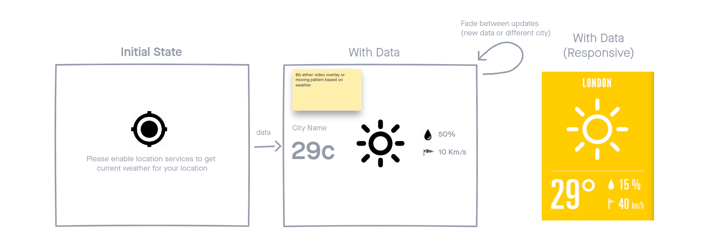

# TableCheck interview task : Weather-app

## Description

## Comments

- normalize.css is used for it's superior browser support (which is needed because we are targeting IE 11). The catch is it's a bit old and janky. i had to write some code in `global-styles.css` regarding `html` and `body` that i probably wouldn't have needed if i used a better CSS reset

- I've lost quite a bit of time to setting up Razzle (apparently it doesn't support the latest v15. i could only get it working properly with LTS v14), and getting used to XState (especially unit testing it). i'm familliar with redux however i was intrigued about XState since it was mentioned in the interview and decided to try it for this task.

- XState's react hooks don't want to play nicely with enzyme, i have to jump through a bunch of loops to get it to work without raising any errors

---

### Wireframe before implementation

### Checklist

- [x] Set up repo with razzle
- [x] convert project to use typescript
- [x] Install xState
- [x] Install Jest/Enzyme
- [x] Clear razzle dummy html/css
- [x] get font and icons and emotion
- [x] wireframe design
- [x] get user geolocation
- [x] install axios
- [x] query weather api for data
- [x] display data, map data to icons
- [ ] refresh every 5 minutes
- [ ] get data for url querystring (comma seperated)
- [ ] animated backgrounds
- [ ] fade animations between refreshes

### Future nice to haves
- [ ] Crossbrowser testing confirmation
- [ ] Only import needed icons from weather-icons
- [ ] Cache and/or render cached weather through SSR
- [ ] Refactor WeatherMachine into smaller actors
- [ ] Page insights testing
- [ ] E2E testing
...