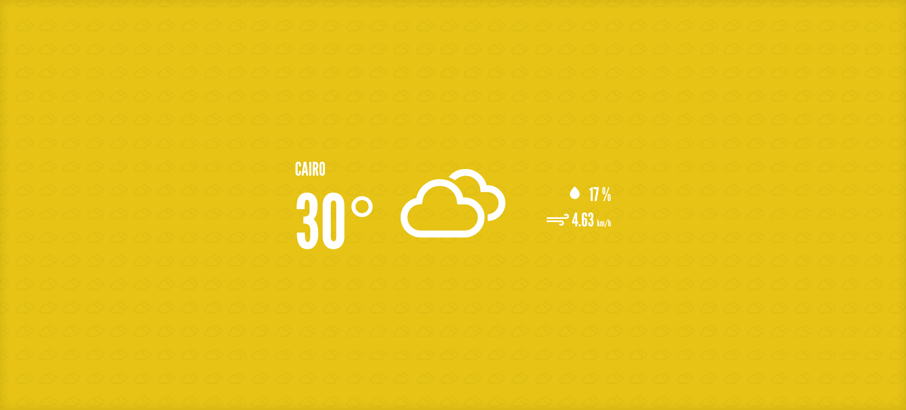
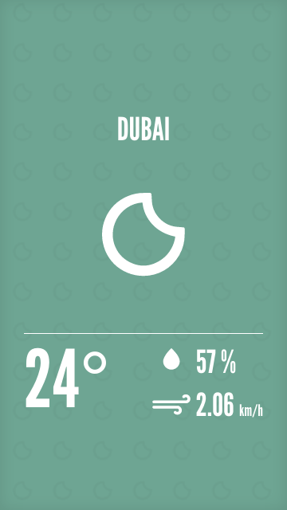
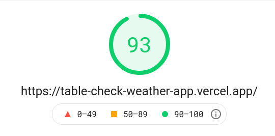
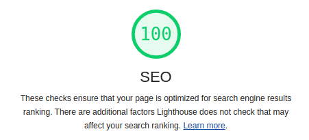
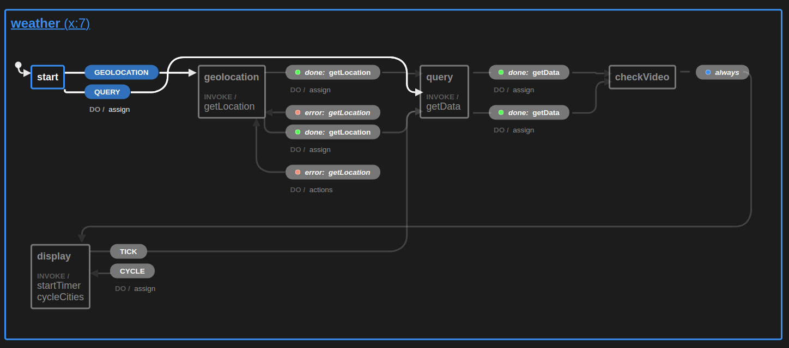

# TableCheck interview task : Weather-app
<!-- TOC -->
- [Description](#description)
- [Images](#images)
- [How to run locally](#how-to-run-locally)
- [Thoughts/Comments while working on the project](#thoughtscomments-while-working-on-the-project)
- [Checklists and Misc Notes.](#checklists-and-misc-notes)
  - [WeatherMachine Visualization](#weathermachine-visualization)
  - [Wireframe before implementation](#wireframe-before-implementation)
  - [Checklist](#checklist)
  - [Future nice to haves](#future-nice-to-haves)
  - [Pending issues](#pending-issues)
<!-- /TOC -->

## Description

Simple application that displays current weather, test at [https://table-check-weather-app.vercel.app/](https://table-check-weather-app.vercel.app/). It works either by asking for your geolocation, or by a list of comma-seperated cities in the query parameters like this example https://table-check-weather-app.vercel.app/?city=tokyo,cairo,london,dubai . Uses data from [OpenWeatherMap](https://openweathermap.org/) .

Made with Razzle, React (FC), Typescript, Emotion/Styled, XState, Storybook, Jest, Enzyme, ESLint, Prettier, Babel and Webpack

## Images

Desktop View

Mobile View

Google PageSpeed Insights

Google Lighthouse

## How to run locally

simply clone the project, run `npm install` and you should be good to go! (and switch out api keys in )
- `npm start` to run locally for development
- `npm run test` to run unit tests
- `npm run storybook` to run storybook
- `npm build` then `npx vercel --prod` to deploy

## Thoughts/Comments while working on the project

- normalize.css is used for it's superior browser support (which is needed because we are targeting IE 11). The catch is it's a bit old and janky. i had to write some code in `global-styles.css` regarding `html` and `body` that i probably wouldn't have needed if i used a better CSS reset

- I've lost quite a bit of time to setting up Razzle (apparently it doesn't support the latest v15. i could only get it working properly with LTS v14), and getting used to XState (especially unit testing it). i'm familliar with redux however i was intrigued about XState since it was mentioned in the interview and decided to try it for this task.

- XState's react hooks don't want to play nicely with enzyme. It's hooks fail in an SSR environment. The generally recommended approach for hooks in this case is to override them or skip them when the code detects there is no browser available. However, i've attempted this with XState and it seems that the bit i need to override is deeper in the library. i opted to not edit the actual package and work around the issue. I test the machines exclusively through an interpreter and not through the react components.

- The bulk of my previous experience was with [Tyro-app](https://tyro-app.com) which had videoconferencing done over websockets and WebRTC. That means that it was a requirement for our users to have recent versions of their browsers, or in some cases completely avoid certain browsers such as IE/Edge as they did not support WebRTC. That means i didn't have a lot of experience with transpiling and polyfilling JS. It took me quite a bit of time and effort to get it working here, especially because i've stopped using Windows and wasn't going to dual-boot or run a VM just to confirm IE11 is working properly. So my development iteration was slow due to needing to use free tiers of online crossbrowser testing services

- I'm very familliar with styled-components. with this project though i decided to try out emotion/css (the project has very little UI elements and would be ideal to test something new). I have to say it does work well and but i think i prefer styled-components more. styled-components is slightly more restrictive in writing, and that is something i actually prefer. it also makes the actual component layout look much cleaner than emotion/css. on the other hand, emotion/css is easier to interpolate dynamically and is platform-agnostic. perhaps it would be ideal to use emotion/css in very small projects then, except i'd probably opt to just use plain SASS/SCSS instead. You could still simply use styled through emotion, but i need to figure out if the extra dependencies are worth it.

- This project essentially boils down to two components (not counting state management/machines). A screen for the initial state, and a screen to display weather information (that cycles into itself). Typically i like to avoid excessive segmentation of components and files and keep things in as few files as possible while keeping things DRY. If at any time i catch myself reusing code or copy/pasting stuff internally, that is a sign i should extract that into it's own reusable piece of code. That being said, the scale of this project wasn't big enough for me to find many signs like that 😅 So i'm left conflicted about having just two active components, or needlessly dividing them into more parts that may be slightly more confusing

- I have not used Storybook before, but i've had such a positive experience with it through this project. While i'm sure there's a lot about it I have yet to learn, I can see how usefull it would be for bridging the gap between developers and designers, sticking to a style guide and last but not least would make UI Regression testing a lot easier than it typically is.

- Regarding Unit Tests, i've been having difficulty actually testing the components. the issue being the components are few and dead simple. They just display data and are not interactable in any way. all of the logic behind the project resides in the actual state machine. I've implemented unit tests for the machine, no problem. The components being almost essentially static, not to mention being able to check UI issues at a glance through Storybook, lead me to think there's not much use writing any meaningful tests for them in their current state

---

## Checklists and Misc Notes.
### WeatherMachine Visualization

### Wireframe before implementation

### Checklist

- [x] Set up repo with razzle
- [x] convert project to use typescript
- [x] Install xState
- [x] Install Jest/Enzyme
- [x] Clear razzle dummy html/css
- [x] get font and icons and emotion
- [x] wireframe design
- [x] get user geolocation
- [x] install axios
- [x] query weather api for data
- [x] display data, map data to icons
- [x] refresh every 5 minutes
- [x] get data from url querystring (comma seperated)
- [x] Deploy
- [x] fade animations between refreshes
- [x] Fix IE11 (tested working properly on chrome/firefox/safari/edge)
- [x] Different layout for desktop view (as per wireframe)

### Future nice to haves
- [x] animated background icons
- [x] Storybook components
- [x] Refactor existing unit tests and implement more
- [x] Remove weather icon font and only import needed icons as SVGs
- [x] Page insights testing
- [x] Visualize machine states
- [~] Dynamic youtube Video backgrounds based on weather (Partially implemented, found out that there's a rather strict quota limit for the youtube api. i'll need to refactor a big portion of what i've already implemented to use a different API to get around this limitation,)
- [ ] E2E testing

### Pending issues
- Scrolling icon background's speed and direction get stuck after completing a full cycle of all listed cities
- Importing the global styles in Storybook's `preview.js` or `preview-head.html` does not display the component properly for some reason? for the time being, importing the global styles inside each component story seems to properly display everything
...